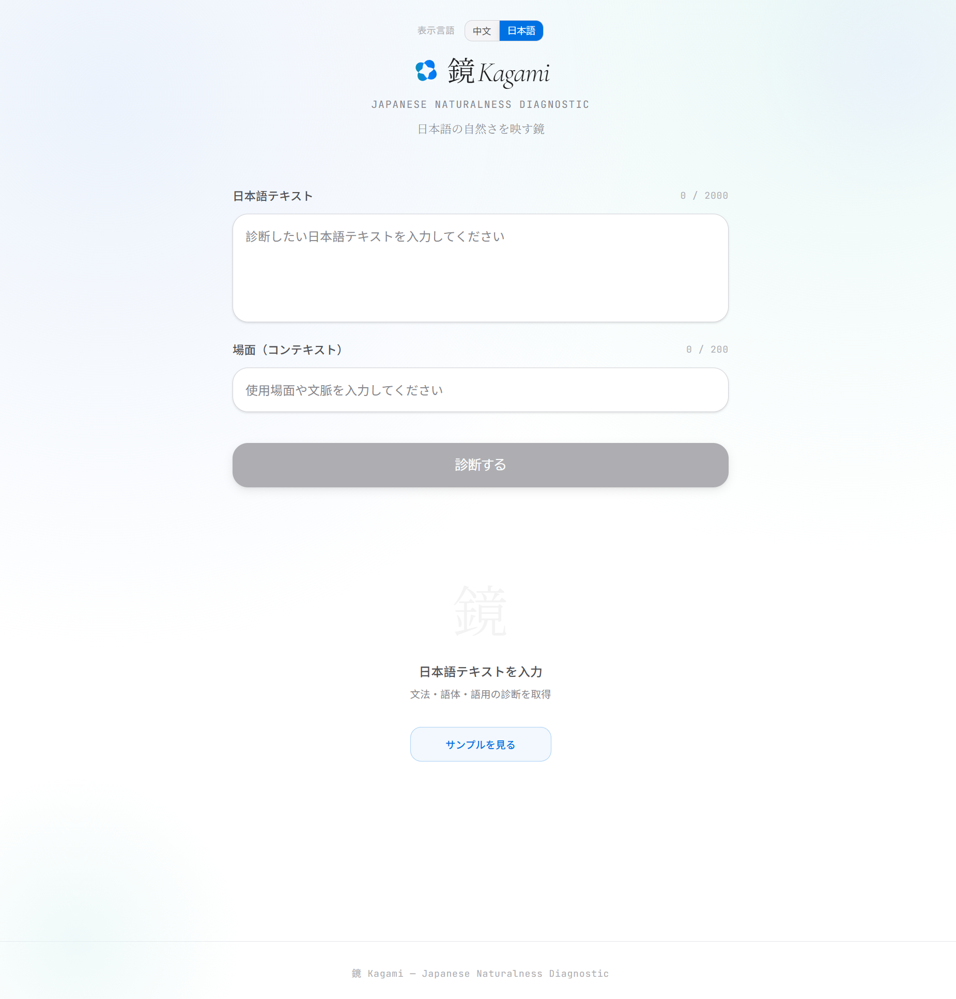
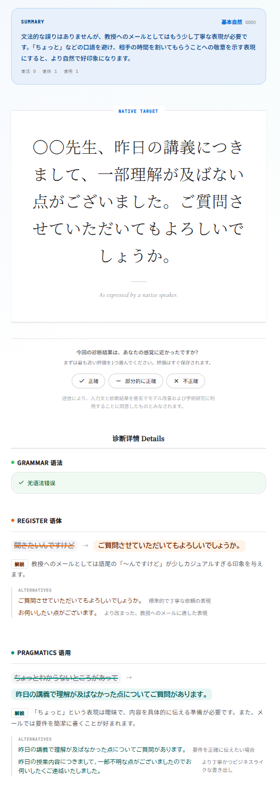

#  Kagami (鏡) - 日本語自然度診断システム

[English](README.md) | [简体中文](README.zh.md) | [日本語](README.ja.md)

---

> **ライブデモ**: [https://kagami.chizunet.cc](https://kagami.chizunet.cc)

| UIプレビュー | 分析の詳細 |
| :---: | :---: |
|  |  |

Kagami（鏡）は、中国語を母語とする日本語学習者のために、日本語出力の自然度を診断・改善することを目的とした、大規模言語モデル（LLM）駆動のプロトタイプシステムです。

従来の文法誤り訂正（GEC）の枠を超え、Kagamiは社会言語学や語用論的な観点を反映した **「三層診断フレームワーク」** を導入しています。

## 🔬 研究の背景

中国語母語の日本語学習者は、文法的には正しいのに語用的には不自然な文を産出しやすいという課題を抱えています。従来の文法誤り訂正（GEC）は規則ベースの誤りには有効ですが、レジスターの適切性や語用的自然さを十分に扱えません。

第二言語習得研究における重要課題の一つは、**メタ語用意識（metapragmatic awareness）** をどのように測定するかです。DCT や発話思考法のような従来手法は、運用コストが高く大規模化が難しいという問題があります。

Kagami は、**LLM が生成した三層診断を語用刺激（stimulus）として提示**し、学習者が各層（Grammar / Register / Pragmatics）をどう受容するかを観測する方法を採用します。Pienemann の Teachability Hypothesis に基づき、語用知識の習得が遅く認知負荷が高いなら、学習者は語法より語用の指摘を受容しにくくなり、三層で**受容率の勾配**が生じるはずだ、という仮説を検証します。

## 🧠 三層診断フレームワーク

ユーザーは日本語のテキストと、特定の **社会的文脈**（例：「教授へのメール」「親しい友人との会話」）を入力します。Kagamiは以下の3つの次元で入力を分析します：

1. **第1層：文法 (Grammar)**
   - 規則に基づく誤り（助詞の誤用、動詞の活用ミスなど）をチェックします。
   - *性質*: 絶対的な正誤。
2. **第2層：レジスター (Register)**
   - 丁寧さのレベルやスタイルが、ユーザーの定義した文脈に合致しているか（敬語の誤用、話し言葉と書き言葉の混同など）を評価します。
   - *性質*: 文脈に依存する妥当性。
3. **第3層：語用 (Pragmatics)**
   - 文法的に正しく文脈にも合っているが、ネイティブスピーカーにとっては不自然な表現を特定します。文脈に基づいて、より自然な表現案を提示します。
   - *性質*: ネイティブのような流暢さと情報構造。
   - Prompt 推論フロー（Step A-D）：
     - Step A: 学習者文をいったん無視し、場面だけから母語話者の自然表現を起草する。
     - Step B: 起草文と学習者文を対照する。
     - Step C: コロケーション、情報順序、表現習慣、語用期待の差分を抽出する。
     - Step D: Step C の差分のみを語用上の問題として報告する。

## 🎯 研究目的

本プロジェクトは、次の一点に焦点を当てます。

> **LLM 生成診断に対する L2 学習者の受容率は、Grammar / Register / Pragmatics の各層で系統的に異なり、その勾配は Teachability Hierarchy と整合するか。**

Kagami は匿名で**個別指摘ごとのフィードバック**を収集します。各指摘に対する 👍/👎 ボタン（層タグ付き：Grammar / Register / Pragmatics）と、任意の自由記述フィードバック欄を提供します。

個別データにより層別受容率を分析できます。Grammar -> Register -> Pragmatics の順で受容率が低下するなら、学習者のメタ語用意識が文法知識に比べて遅れている可能性を示し、Teachability Hierarchy と整合的な所見となります。

> [!IMPORTANT]
> **学習者の同意/不同意は真値ではありません。** これは診断の受容（学習者認知）を示す指標であり、診断の正確性（言語学的真偽）そのものではありません。今後は母語話者ゴールドアノテーションを導入し、LLM-vs-Gold、Learner-vs-Gold、Learner-vs-LLM の三者比較を行います。

## 🛠 技術スタック

- **フロントエンド**: Next.js 16 (App Router), React 19, Tailwind CSS 4
- **デザインシステム**: Apple HIG（ヒューマンインターフェースガイドライン）に触発されたミニマリズムな美学（カスタムデザイントークン）
- **AI 統合**: Google Generative AI SDK (Gemini 3.1 Flash)。厳格な JSON Schema 制約による生成。
- **データ収集**: Cloudflare KV (匿名化された人間による評価データの収集)

## 📊 人間による評価メカニズム

Kagamiは第二言語習得・NLP研究のため、各診断指摘に👍/👎の匿名フィードバックボタンを設置し、文法・レジスター・語用の各層にタグ付けして収集します。この個別指摘データにより層別受容率を分析でき、学習者が文法—レジスター—語用の連続体でどのように診断を受け入れるか（メタ語用意識の代理指標）を捉えられます。また、任意の自由記述フィードバック欄を提供し、構造化された評価を強制しません。学習者フィードバックは診断受容度（学習者認知）の指標であり、LLM精度の真値とはみなしません。今後は少数の母語話者によるゴールドアノテーションを導入し、LLM-vs-Gold・Learner-vs-Gold・Learner-vs-LLMの三者比較を行う予定です。

## 👨‍💻 開発者について

**Chizukuo** による個人研究プロジェクトです。本プロジェクトは、大学院進学（NAIST志望）に向けた予備研究として開発されました。

## 📄 ライセンス

このプロジェクトは [MIT ライセンス](LICENSE) の下でライセンスされています。
